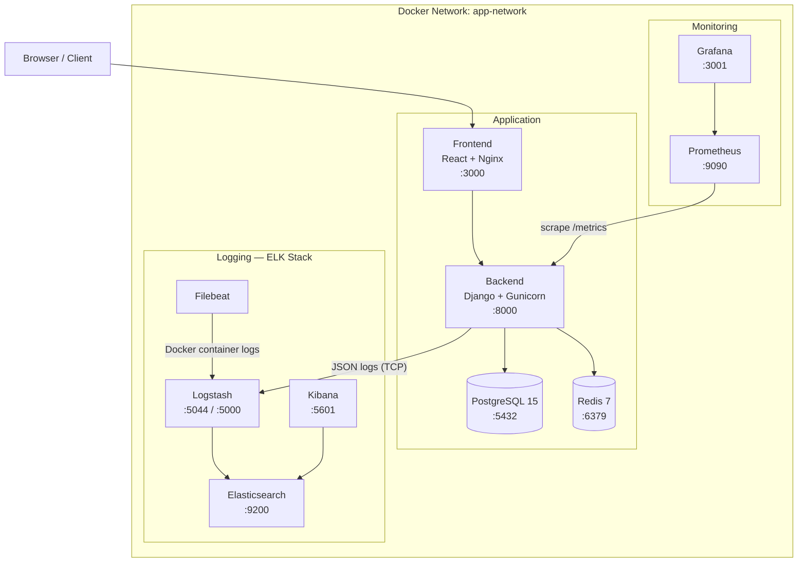

# Project Finder

Платформа для поиска и матчинга специалистов с проектами. Реализует механизм взаимных лайков: если специалист лайкнул проект и владелец проекта лайкнул специалиста — создаётся Match.

---

## Архитектура



---

## Стек технологий

| Слой | Технология |
|---|---|
| Backend | Django 4.2, Django REST Framework, SimpleJWT |
| Frontend | React, Material-UI, Axios, React Router |
| База данных | PostgreSQL 15 |
| Кэш | Redis 7 |
| Веб-сервер | Gunicorn (4 workers) + Nginx |
| Контейнеризация | Docker, Docker Compose |
| CI/CD | GitHub Actions |
| Registry | GitHub Container Registry (GHCR) |
| Мониторинг | Prometheus, Grafana |
| Логирование | ELK Stack (Elasticsearch, Logstash, Kibana, Filebeat) |
| Метрики | django-prometheus |
| IaC | Ansible |

---

## CI/CD Pipeline

### Схема pipeline

```
push / pull_request → main
         │
         ├── lint ──────────────── flake8 + black + isort + bandit
         │
         ├── test ──────────────── pytest + coverage → artifact: coverage.xml
         │
         ├── build ─────────────── docker build backend + frontend (GHA cache)
         │         (needs: lint, test)
         │
         ├── trivy ─────────────── scan backend image → artifact: trivy.sarif
         │         (needs: build)
         │
         └── push ──────────────── push backend + frontend → ghcr.io  [main only]
                   (needs: build, trivy)
```

### Описание jobs

| Job | Триггер | Что делает |
|---|---|---|
| **lint** | push / PR | flake8 — стиль кода; black — форматирование; isort — порядок импортов; bandit — статический анализ безопасности Python |
| **test** | push / PR | pytest с SQLite in-memory, генерирует `coverage.xml`, загружает как артефакт |
| **build** | после lint + test | docker build обоих образов с GHA-кэшем (без push) |
| **trivy** | после build | сканирует backend-образ на CVE уровня CRITICAL/HIGH, загружает SARIF-отчёт |
| **push** | после build + trivy, только main | login в GHCR, push backend и frontend с тегами `latest` + SHA коммита |

### Образы в GHCR

После успешного merge в `main` образы доступны:
```
ghcr.io/sergeywork21/finder2/backend:latest
ghcr.io/sergeywork21/finder2/backend:<sha>

ghcr.io/sergeywork21/finder2/frontend:latest
ghcr.io/sergeywork21/finder2/frontend:<sha>
```

---

## Быстрый старт (локально)

### Требования

- Docker Engine 24+
- Docker Compose v2

### Запуск

```bash
# 1. Скопировать конфиг
cp .env.example .env

# 2. Поднять все сервисы
docker compose up -d --build

# 3. Проверить состояние
docker compose ps
```

### Сервисы после запуска

| Сервис | URL |
|---|---|
| Frontend | http://localhost:3000 |
| Backend API | http://localhost:8000/api/v1/ |
| Django Admin | http://localhost:8000/admin/ |
| Prometheus | http://localhost:9090 |
| Grafana | http://localhost:3001 |
| Kibana | http://localhost:5601 |
| Elasticsearch | http://localhost:9200 |

### Makefile команды

```bash
make up       # docker compose up -d
make down     # docker compose down
make build    # docker compose up --build -d
make logs     # docker compose logs -f
make test     # pytest
make lint     # flake8 + black --check + isort --check
make format   # black + isort (авто-форматирование)
make migrate  # python manage.py migrate
make shell    # django shell
```

---

## API

| Метод | Endpoint | Описание | Auth |
|---|---|---|---|
| POST | `/api/v1/auth/register/` | Регистрация | — |
| POST | `/api/v1/auth/login/` | Получение JWT токена | — |
| GET/PUT | `/api/v1/auth/profile/` | Профиль текущего пользователя | JWT |
| GET | `/api/v1/projects/` | Список проектов | JWT |
| POST | `/api/v1/projects/` | Создать проект | JWT |
| GET/PUT/DELETE | `/api/v1/projects/<id>/` | Проект по ID | JWT |
| POST | `/api/v1/likes/` | Поставить лайк | JWT |
| GET | `/api/v1/matches/` | Список матчей | JWT |
| GET | `/health` | Healthcheck (DB + Redis) | — |
| GET | `/metrics` | Prometheus метрики | — |

---

## Мониторинг

### Prometheus + Grafana

Django экспортирует метрики через `django-prometheus` по адресу `/metrics`.

**Что мониторится:**
- HTTP запросы: количество, latency, статус-коды (`django_http_requests_total`, `django_http_responses_total`)
- База данных: количество запросов, время выполнения (`django_db_*`)
- Модели: операции create/update/delete по каждой модели
- Системные метрики контейнера (CPU, RAM, сеть)

**Grafana** доступна на `:3001`, логин/пароль из `.env` (`GF_SECURITY_ADMIN_USER` / `GF_SECURITY_ADMIN_PASSWORD`).

Дашборд Django provisioned автоматически из `monitoring/grafana/dashboards/django.json`.

Datasource Prometheus provisioned из `monitoring/grafana/provisioning/`.

### Healthchecks

Все критичные сервисы имеют healthcheck в docker-compose:

| Сервис | Проверка |
|---|---|
| PostgreSQL | `pg_isready` |
| Redis | `redis-cli ping` |
| Backend | `curl /health` |
| Frontend | `wget localhost:3000` |
| Elasticsearch | cluster health API |
| Kibana | `/api/status` |

Сервисы запускаются только после того, как зависимости стали `healthy` (`depends_on: condition: service_healthy`).

---

## Логирование (ELK Stack)

### Поток логов

```
Django app
    │── JSON logs (TCP :5000) ──→ Logstash
                                      │
Filebeat ──→ Docker container logs ──→│
                                      ↓
                              Elasticsearch
                              index: finder-logs-YYYY.MM.dd
                                      │
                                   Kibana
                              (визуализация, поиск)
```

### Что логируется

- Все HTTP запросы к Django API (уровень INFO)
- Ошибки приложения (уровень ERROR + stack trace)
- Аутентификация (login/logout события)
- Django ORM запросы (в DEBUG режиме)

### Просмотр логов в Kibana

1. Открыть http://localhost:5601
2. `Stack Management` → `Index Patterns` → создать паттерн `finder-logs-*`
3. `Discover` → выбрать паттерн → смотреть логи

---

## Безопасность

| Практика | Реализация |
|---|---|
| Secrets management | `.env` вне git (`.gitignore`), GitHub Secrets в CI |
| Non-root container | Backend запускается как `appuser` (не root) |
| Static security analysis | Bandit в CI — сканирует Python-код на уязвимости |
| Vulnerability scanning | Trivy в CI — сканирует Docker-образ на CVE |
| JWT Authentication | HS256, configurable expiry |
| SQL injection | Django ORM + parameterized queries |
| CORS | Настраивается через `BACKEND_CORS_ORIGINS` |

---

## Infrastructure as Code (Ansible)

Плейбук для деплоя на Ubuntu-сервер с Docker:

```bash
# Установить зависимости
pip install ansible

# Настроить инвентарь
vim ansible/inventory.ini  # указать IP сервера

# Запустить деплой
ansible-playbook -i ansible/inventory.ini ansible/playbook.yml \
  -e "ghcr_user=sergeywork21" \
  -e "ghcr_token=YOUR_TOKEN" \
  --ask-become-pass
```

**Что делает плейбук:**
1. Устанавливает Docker + docker-compose-plugin
2. Добавляет пользователя в группу `docker`
3. Клонирует репозиторий
4. Копирует `.env` на сервер
5. Логинится в GHCR и делает `docker compose pull`
6. Запускает `docker compose up -d`
7. Применяет миграции
8. Проверяет healthcheck `/health`

---

## Структура проекта

```
finder2/
├── .github/
│   └── workflows/
│       └── ci.yml            # CI/CD pipeline
├── ansible/
│   ├── group_vars/all.yml    # Переменные деплоя
│   ├── inventory.ini         # Инвентарь серверов
│   └── playbook.yml          # Плейбук деплоя
├── backend/
│   ├── apps/
│   │   ├── users/            # Пользователи, авторизация
│   │   ├── projects/         # Проекты
│   │   ├── likes/            # Лайки
│   │   └── matches/          # Матчи
│   ├── config/               # Django settings, urls, wsgi
│   ├── tests/                # pytest тесты
│   ├── Dockerfile
│   ├── requirements.txt
│   ├── requirements-test.txt
│   ├── requirements-lint.txt
│   └── pytest.ini
├── frontend/
│   ├── src/                  # React исходники
│   └── Dockerfile            # Multi-stage: Node → Nginx
├── monitoring/
│   ├── prometheus.yml        # Конфиг scrape
│   ├── grafana/
│   │   ├── provisioning/     # Datasources
│   │   └── dashboards/       # Django dashboard JSON
│   └── elk/
│       ├── elasticsearch/    # elasticsearch.yml
│       ├── logstash/         # pipeline/logstash.conf
│       ├── kibana/           # kibana.yml
│       └── filebeat/         # filebeat.yml
├── docker-compose.yml        # 11 сервисов
├── Makefile
└── .env.example
```

---

## Тесты

```bash
# Локально
cd backend
pip install -r requirements-test.txt
pytest

# С отчётом покрытия
pytest --cov=. --cov-report=term-missing

# Только конкретный модуль
pytest tests/test_auth.py -v
```

Тест-покрытие: auth, health, likes, matches, projects.
